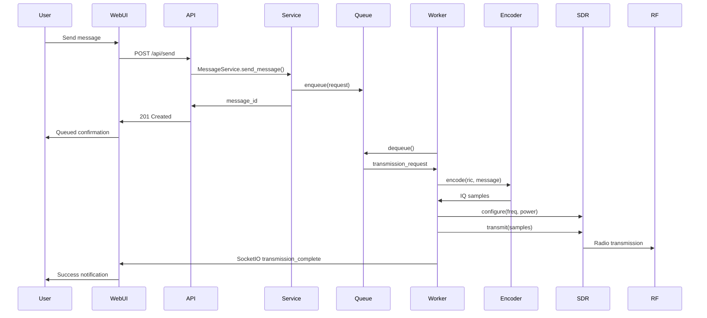
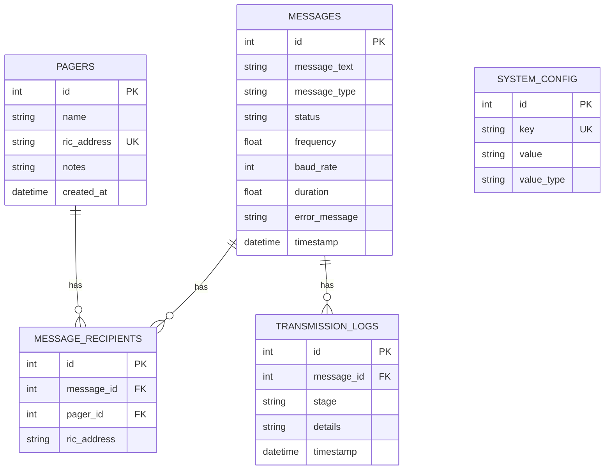

# Architecture

## System Overview
PISAG is an educational POCSAG pager transmission stack for Raspberry Pi + HackRF One. It couples a Flask/SocketIO backend, a plugin-based encoder/SDR layer, and a vanilla JavaScript SPA frontend with real-time updates.

## Architecture Diagram


## Components
- **Flask application** ([pisag/app.py](../pisag/app.py)): App factory, CORS, SocketIO setup, error handlers, graceful shutdown, device monitor wiring.
- **API layer** ([pisag/api/routes.py](../pisag/api/routes.py), [pisag/api/socketio.py](../pisag/api/socketio.py)): REST endpoints, health/status, SocketIO event emitters, structured errors.
- **Service layer** ([pisag/services](../pisag/services)): Business logic (`MessageService`, `PagerService`, `ConfigService`, `AnalyticsService`), queue management, worker, device monitor, system status singleton.
- **Transmission infrastructure**: Queue ([transmission_queue.py](../pisag/services/transmission_queue.py)), worker thread ([transmission_worker.py](../pisag/services/transmission_worker.py)), device monitor ([device_monitor.py](../pisag/services/device_monitor.py)), system status ([system_status.py](../pisag/services/system_status.py)).
- **Database layer** ([pisag/models](../pisag/models)): SQLAlchemy models, session helpers, Alembic migrations.
- **Plugin system** ([pisag/plugins/base.py](../pisag/plugins/base.py)): Abstract encoder/SDR interfaces; default gr-pocsag encoder drives the HackRF flowgraph, with a no-op SDR placeholder when gr-pocsag owns RF.
- **Configuration** ([pisag/config.py](../pisag/config.py)): JSON defaults merged with DB overrides at runtime.
- **Frontend** ([static/](../static)): Vanilla JS SPA modules (API client, SocketIO client, tab logic) with real-time updates.

## Data Flow
```mermaid
flowchart TD
    A[User Input] --> B{Message Type}
    B -->|Individual| C[Select Pager]
    B -->|Broadcast| D[Select Multiple]
    C --> E[Validate Input]
    D --> E
    E --> F[Create Message Record]
    F --> G[Queue Transmission]
    G --> H[Worker Dequeues]
    H --> I[POCSAG Encode (gr-pocsag)]
    I --> J[GNU Radio Flowgraph]
    J --> K[HackRF Transmit]
    K --> L[Update Status]
    L --> M[Log Transmission]
    M --> N[Notify Frontend]
```

## Database Schema


## Technology Stack
- Python 3.9+, Flask 3.x, Flask-SocketIO
- SQLAlchemy 2.x, Alembic, SQLite
- GNU Radio + gr-osmosdr + HackRF, NumPy, bitstring
- Vanilla JavaScript + Socket.IO client

## Design Decisions
- Plugin architecture for encoder/SDR to allow swaps
- Hybrid JSON + DB configuration for runtime overrides
- Request-scoped DB sessions for thread safety
- Background worker for non-blocking transmission
- Device monitor to auto-reconnect and pause/resume queue
- Extensive comments for educational clarity

## Threading Model
- Flask main thread handling HTTP/SocketIO
- Transmission worker thread consuming queue
- Device monitor thread checking SDR health
- Graceful shutdown coordinates worker + monitor + logging

## Error Handling Strategy
- Validation in services and API routes with structured JSON errors
- Specific exceptions for encoding/config/transmission; DB rollback on failures
- SocketIO events for status and failure notifications
- Rotating file logging with context-rich entries
